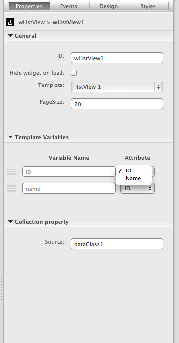

## wListView Widget for [Wakanda](http://wakanda.org)
This widget displays data from a datasource in list format. It comes with three predefined templates that you can easily adapt. Moreover, you can create your own templates to use with this widget.

This widget is especially efficient for mobile devices (smartphones or tablets). It has a "load more" implementation that automatically loads more data for you when the user arrives at the end of the list.

wListView Tutorial
=================
The following subjects are covered in this tutorial:

* **Basics:** How to configure the wListView widget in Wakanda Studio
* **Adding/editing templates** How to create your own template or edit an existing one
* **Advanced:** How to create your own template with images and optional elements

## 1. Studio Configuration

You can configure the following options for this widget:

### 1.1 General

* **Template**: The template to use that will display the data (see below for more information regarding templates)
* **Page size**: The number of items to fetch initially (and at the end of each page)

### 1.2 Template Variables

In this section, you map each attribute in the template to an attribute in your server datasource (datastore class attribute). You can map the same attribute to several variable names.

### 1.3 Collection Property

The Source property is the datasource that will supply data to this wListView widget. Each entity in your datasource's collection, up to *Page size*, will be rendered using the map that was previously set.

## 2. Adding/Editing templates

The templates are defined in the `widget.js` file where the template property is defined:

            template: Widget.property({
                type: 'template',
                templates: [
                    {
                        name: 'EMail List',
                        template: '<li class="waf-studio-donotsave emailList{{#if isRead}} read{{/if}}"><date>{{date}}</date>{{#if attachment}}{{/if}} <h3>{{email}}</h3><button class="star"></button>
{{text}}
{{tag}}</li>'
                    },
                    {
                        name: 'Navigation',
                        template: '<li class="waf-studio-donotsave navList"><a class="nav" href="#">&gt;</a><strong>{{name}}</strong>
{{text}}
</li>'
                    },
                ],
                defaultData: {
                    items: [
                        {
                            name: 'John Smith',
                        }
                    ]
                },
                datasourceProperty: 'collection'
            })

Each template is defined by two properties:

* **name**: Template name as shown in **1.2**
* **template**: An HTML fragment that contains special **variables** that will be replaced by the data from the attributes set in the *template variables* property.

### 2.1 Adding a template

To add a new template to your widget, simply add a new object to the array.

**NOTE:** When modifying the `widget.js` file, you *must* **reload** your page.

### 2.1 Editing a template

A template is basically an HTML fragment with **special variables** enclosed in curly braces (*{{variable}}*) that represent a datastore class attribute. When the wListView widget is published, the variables defined in the template are replaced by the attribute set in the widget's properties.

The template follows the [HandleBars][handlebars] template, which is a powerful JavaScript template system that's already used in many products, like EmberJS.

The variables (enclosed in curly braces) must begin with a letter. You cannot use any special characters or spaces (which are reserved for advanced template management).

Template example:

    {
        name: 'listView 1',
        template: '<li><strong>(ID = _({{ID}})</strong>name = {{name}}</li>',
    }

This template is named "listView1" and has two variables: *ID* and *name*.

If you have a datasource with the following entities:

    {ID: 0, name: 'Mark'}, {ID:1, name: 'John'}

The data in the template will be rendered like this:

    <li><strong>(ID = _(0)</strong>name = Mark</li>
    <li><strong>(ID = _(1)</strong>name = John</li>

## 3. Advanced

The good thing about templates is that they are not limited to variables. You can also:

* use conditional elements or
* format your variables (eg. date, currency,...)

In the following example, we will learn how to create more complex templates, like the "EMail List" one:

This template has the following features:

* a row can be selected depending on the attribute's value
* a row displays the *attachement* icon only if the attachment variable is set to true
* a row uses a variable as an  source tag
* the date will be formatted depending on today's date
* rows that have the "favorite" attribute set to true display the "star" icon

As you can see, you can display data using templates with very little code.

Here is the template:

    <li class="waf-studio-donotsave emailList{{#if isRead}} read{{/if}}">
      <date>{{date}}</date>
      {{#if attachment}}
         
      {{/if}}
       
      <h3>{{email}}</h3>
      <button class="star"></button>
      
{{text}}

      {{tag}}
    </li>

Let's go over each line:

* The special variable `{{#if variable}}...{{/if}}` allows you to include text depending on a boolean value. In the above example, the *read* CSS class will  be added to the row only if the *isRead* variable is set to true.
* The same conditional test is used for the *attachment* attribute.
* You may have noticed that the date format is variable: it actually depends on today's date. It displays *hier* (yesterday) if the date was yesterday, only the time if it is today, or the full date. To do that, we have simply
defined a hook using the `setHook` method:
    wListView = Widget.create('wListView', undefined, {
        init: function() {
            this.setHook('date', function(dateStr) { return 'the date is: ' + str; })
        }
        });
* Variables can be placed anywhere in the HTML template, including in attribute values. 
The *avatar* variable is used as the source for the image tag: ``

As you can see, it's quite simple to extend templates to create complex lists.

[handlebars]: http://handlebarsjs.com/ "Visit HandleBars website"

### More Information
You can install a custom widget by using the [Add-ons Extension](http://doc.wakanda.org/WakandaStudio/help/Title/en/page4263.html "Add-ons Extension"). For more information, refer to the [Installing a Custom Widget](http://doc.wakanda.org/WakandaStudio/help/Title/en/page3869.html#1056003 "Installing a Custom Widget") manual.

For more information about creating a custom widget, refer to the [Widgets v2 Creating a Widget](http://doc.wakanda.org/Wakanda/help/Title/en/page3849.html "Widgets v2 Creating a Widget") manual.
